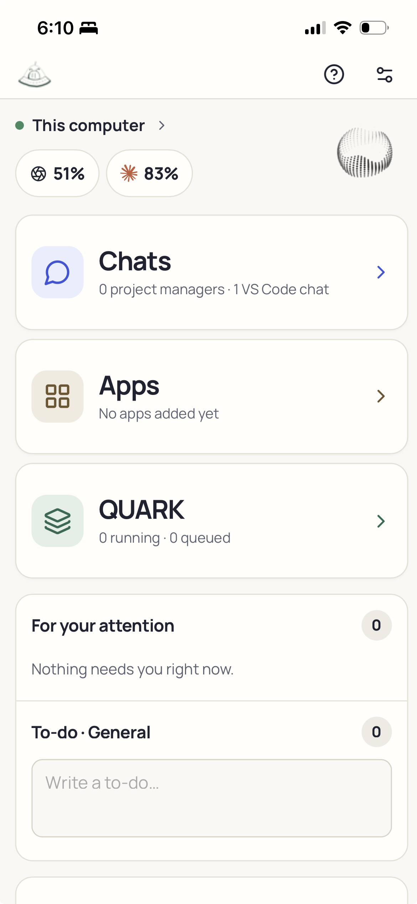
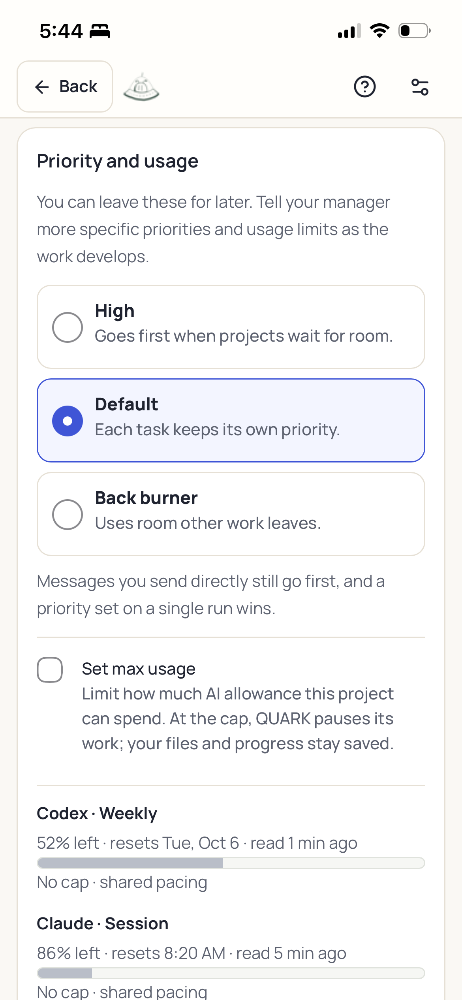
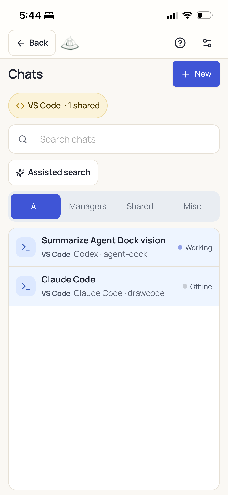
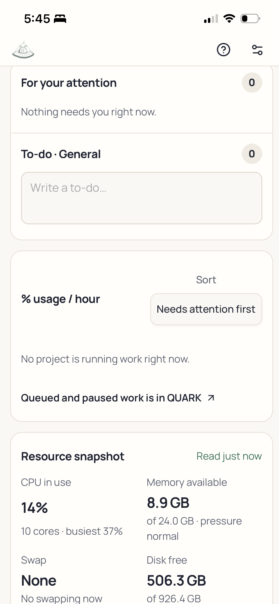
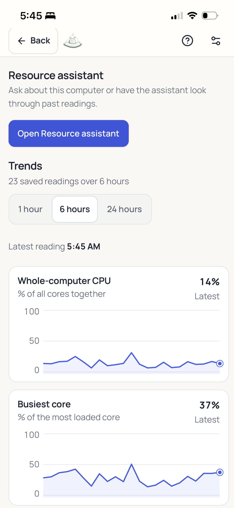
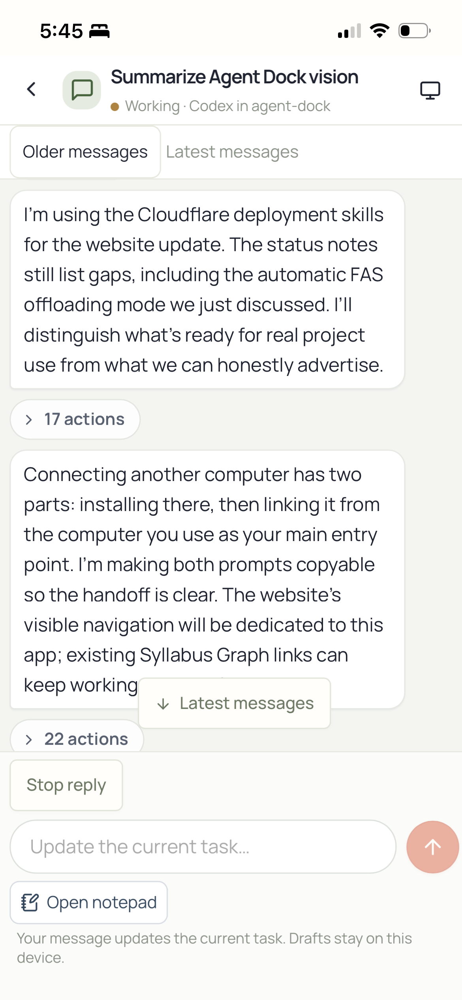
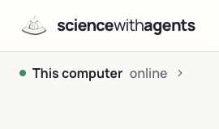

# sciencewithagents

Run Codex and Claude project teams from your computer or phone. QUARK coordinates their
queue, shared allowance and computer resources. Personal conversations and worker records
stay local; Groups publishes explicitly shared content to its configured group service.

## Set up

**Shared group?** Use the [Groups setup prompt](#groups-beta).

For your own projects, paste this into Codex or Claude on the computer that will run your agents:

```text
Set up sciencewithagents from https://github.com/OscarBarreraGithub/sciencewithagents.
Find and preserve any existing installation. Otherwise clone it into a local folder
outside cloud sync. Follow docs/CONTRIBUTOR_SETUP.md and check docs/STATUS.md first.
Use my own Codex or Claude account; I do not need both. Handle the technical setup,
install the Mac Applications launcher when supported, and open the app. Help me
choose my manager and worker defaults, then prepare my first project without sending
its brief until I am ready. Keep phone access, VS Code sharing and GitHub backup
optional. Ask me only for necessary sign-in, device and preference steps. Do not run
the full developer test suite for ordinary setup. Explain how to reopen the app and
report anything incomplete rather than claiming success.
```

## Groups beta

Each person installs the app on their own computer and uses their own Codex or Claude
account. The creator needs one beta setup code from the operator; everyone else joins
with an invitation and the creator's approval. Desktop Groups uses the built-in beta
service. It needs no Cloudflare account or Tailscale setup. Phone access and Git sharing
are optional. See [Groups setup](docs/GROUP_WORKFLOW.md).

Send new members a link to this section and their invitation privately. They can paste
this into Codex or Claude on their own computer:

```text
Set up sciencewithagents for Groups from
https://github.com/OscarBarreraGithub/sciencewithagents.
Find and preserve my existing installation, accounts, files and running work.
Follow docs/CONTRIBUTOR_SETUP.md and docs/GROUP_WORKFLOW.md. Use my own Codex or
Claude account. Handle the desktop setup and open Home → Groups. I will provide
either a beta setup code to create one project or an invitation to join one.
If joining, give me the confirmation code to send privately to the inviter for approval.
Explain Shared chat and Private to you. Enable group agents using my existing provider
sign-in and normal native tools; do not install Docker or set up a separate Linux
account. Keep phone access, VS Code sharing and Git optional. Verify a shared
message in both directions and a private Ask with me. Ask only for necessary sign-in,
consent and preference steps. Preserve private work and report any remaining blocker.
```

[Phone or laptop access](docs/PHONE_WORKFLOW.md) · [Another worker computer](docs/MULTI_COMPUTER_SETUP.md) · [Update an installation](docs/UPDATE_APP.md)

**Access:** agents use your account's native tools and full-access execution by default,
including files, commands and network access. Explicit read-only or restricted choices stay
enforced. Shared and private chats have separate histories; this is not a filesystem sandbox.
See [native access](docs/DECISIONS.md#native-agents-thin-supervision) and
[Groups setup](docs/GROUP_NATIVE_OWNER_SETUP.md).

**Requirements:** a coding agent, Node 24+, Git, and a working Codex CLI or Claude Code
account. Your setup agent checks these. Apple Silicon macOS is the verified desktop target;
see [other platforms](docs/CONTRIBUTOR_SETUP.md#check-the-machine-first).

**Status:** beta. Tested workflows, device limitations and unfinished features are listed in
[current status](docs/STATUS.md). This is source installation, not a one-click installer.
The computer must stay awake and running the app for work and phone access.

## Beta demo

These are temporary beta screenshots with some empty or incomplete data. The interface
will change; these images will be replaced for the final presentation. See
[current status](docs/STATUS.md) for known gaps.

### Home

Your starting point on the phone: see the selected computer and remaining Codex and Claude
allowance, open your chats or QUARK's work queue, and find items needing your attention
alongside your own to-do list. Apps includes a LaTeX/PDF reader for reports on your phone.



### Projects that wait their turn

Set a project to **Back burner** for work you want done when other work is out of the way.
With QUARK scheduling enabled, it waits while higher-priority jobs are running or ready to
run. Optional usage caps pause work without deleting files or progress.



### VS Code chats alongside your managers

Bring shared Codex and Claude Code conversations from VS Code into the same app as your
project managers, including on your phone. Shared editor chats keep their identity and
stay distinguishable from managers and background helpers.



### Attention items, current jobs and computer usage

Items needing your input come first, alongside your general to-do list. Below them, see
active projects' estimated AI allowance use per hour and a snapshot of CPU, memory, swap
and free disk space. The percentage is an estimate of each provider allowance window,
not an exact token bill. This example has no active project jobs to populate the list.



### A resource assistant for your computer

Talk to a dedicated agent about slowdowns and let it inspect current conditions and past
readings. I use it to investigate issues such as runaway Chrome processes instead of
trying to diagnose everything from a single CPU percentage.

The lightweight watcher monitors continuously while the computer is awake and the app
is running. The AI assistant wakes for your questions or optional automatic checks;
it does not spend tokens continuously. Sustained resource changes can wake a check that
connects busy processes and scripts to QUARK’s projects. The charts show how conditions
change over time.



### Working from a phone, with room to write

Continue the same conversation from your phone: read replies, expand grouped tool activity,
send messages, steer or queue follow-ups where supported, and stop a reply. For longer
prompts, I often use **Open notepad**: a full-page editor with autosaved local versions.
Minimize it back into chat without sending or losing the draft.



### Manage multiple computers

Use the computer selector to switch between connected sciencewithagents installations
from the same app, including on your phone. Each computer keeps its own projects,
conversations and Codex or Claude sign-ins. A selected computer must be awake, reachable
and running the app; switching views does not move running jobs between computers.



[Features](docs/FEATURES.md) · [Setup details](docs/CONTRIBUTOR_SETUP.md) ·
[Documentation](docs/README.md) · [MIT licence](LICENSE)
